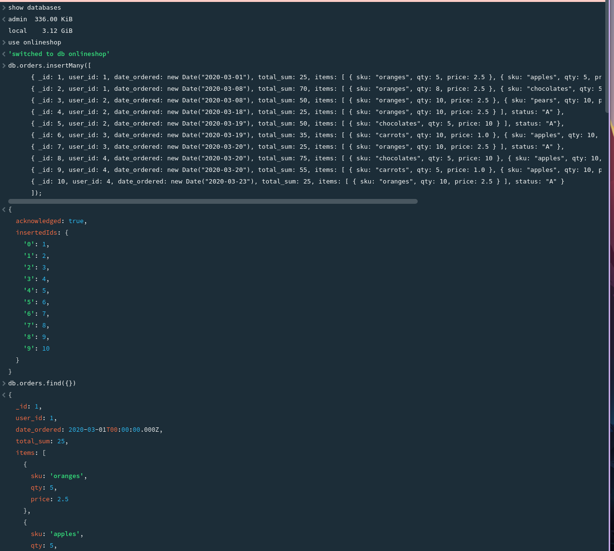
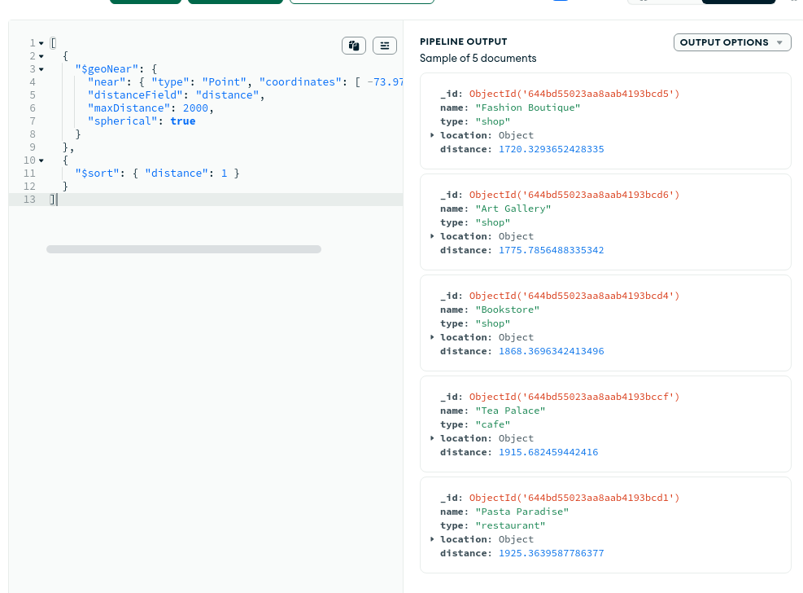

= Exercise 02
:source-highlighter: rouge
:author: Florian Weingartshofer
:rouge-style: github

== Exercises with MongoDB
=== Step 01
Mongo Atlas is used to host a mongo instance.

. Create database `use onlineshop`
. Insert orders `db.orders.insertMany({...})`
. Find all orders `db.orders.find({})`

.Show Databases, create Onlineshop, insert orders and find them

<<<
=== Step 02
MongoDB's MapReduce is a data processing technique that uses two stages, Map and Reduce, to perform complex aggregations on large datasets in MongoDB.
The Map stage selects and maps data to a key-value pair, while the Reduce stage aggregates the data by key and processes the key-value pairs using a reducer function.

=== Step 03
An aggregation was created, that groups users and their orders together.

Here an aggregation to get the total number of orders, total sales, and average sales per order per user.

.Simple Pipeline
[source,json]
----
[
  {
    "$group": {
      "_id": "$user_id",
      "num_orders": { "$sum": 1 },
      "total_sales": { "$sum": "$total_sum" },
      "avg_sales": { "$avg": "$total_sum" }
    }
  }
]
----

This pipeline takes a collection of orders and breaks down each order into individual items.
It then groups the orders by user and item, and calculates the total quantity sold and revenue generated by each item.

The results are then sorted by user and revenue generated, and grouped by user to find the top-selling items and revenue for each user.

The final output is sorted by total revenue generated, so users with the highest revenue appear first.

.Complex Pipeline
[source,json]
----
[
  {
    "$unwind": "$items"
  },
  {
    "$group": {
      "_id": {
        "user_id": "$user_id",
        "sku": "$items.sku"
      },
      "total_qty": {
        "$sum": "$items.qty"
      },
      "total_revenue": {
        "$sum": {
          "$multiply": [
            "$items.qty",
            "$items.price"
          ]
        }
      }
    }
  },
  {
    "$sort": {
      "_id.user_id": 1,
      "total_revenue": -1
    }
  },
  {
    "$group": {
      "_id": "$_id.user_id",
      "top_items": {
        "$push": {
          "sku": "$_id.sku",
          "total_qty": "$total_qty",
          "total_revenue": "$total_revenue"
        }
      },
      "total_revenue": {
        "$sum": "$total_revenue"
      }
    }
  },
  {
    "$sort": {
      "total_revenue": -1
    }
  }
]
----

<<<
=== Step 04
Delete all orders

.Delete

.Drop Database

<<<
=== Step 05
I created a locations database and generated a few locations:

.Locations
[source,json]
----
[
  {
    "name": "Coffee Central",
    "type": "cafe",
    "location": {
      "type": "Point",
      "coordinates": [-73.979388, 40.765124]
    }
  },
  {
    "name": "Tea Palace",
    "type": "cafe",
    "location": {
      "type": "Point",
      "coordinates": [-73.958885, 40.768637]
    }
  },
  {
    "name": "Gourmet Burger Joint",
    "type": "restaurant",
    "location": {
      "type": "Point",
      "coordinates": [-73.978003, 40.762292]
    }
  },
  {
    "name": "Pasta Paradise",
    "type": "restaurant",
    "location": {
      "type": "Point",
      "coordinates": [-73.979609, 40.767019]
    }
  },
  {
    "name": "Sushi Spot",
    "type": "restaurant",
    "location": {
      "type": "Point",
      "coordinates": [-73.965967, 40.764703]
    }
  },
  {
    "name": "Veggie Delight",
    "type": "restaurant",
    "location": {
      "type": "Point",
      "coordinates": [-73.977179, 40.762282]
    }
  },
  {
    "name": "Bookstore",
    "type": "shop",
    "location": {
      "type": "Point",
      "coordinates": [-73.963534, 40.767352]
    }
  },
  {
    "name": "Fashion Boutique",
    "type": "shop",
    "location": {
      "type": "Point",
      "coordinates": [-73.964707, 40.768449]
    }
  },
  {
    "name": "Art Gallery",
    "type": "shop",
    "location": {
      "type": "Point",
      "coordinates": [-73.968483, 40.767281]
    }
  }
]
----

Then create indices on the collection for `geoNear` and `text.search` to work.

.Indices

<<<
Here a pipeline that searches for a sushi place.

.search
[source,json]
----
[
  {
    "$match": {
      "$text": { "$search": "sushi" }
    }
  },
  {
    "$sort": { "distance": 1 }
  }
]
----

.Search Result

Here is a pipeline that searches for everything in a 2km radius.

.geoNear
[source,json]
----
[
  {
    "$geoNear": {
      "near": { "type": "Point", "coordinates": [ -73.9712, 40.7831 ] },
      "distanceField": "distance",
      "maxDistance": 2000,
      "spherical": true
    }
  },
  {
    "$sort": { "distance": 1 }
  }
]
----

.GeoNear Result

I wanted to combine both aggregations into one pipeline, but mongo only allows both aggregations on the first stage, i.e. they have to be the first element, so I split the pipeline into two.

== Exercises with MongoDB Atlas Data API

A few documents were generated and inserted:

[source,javascript]
----
db.product.insertMany([
  {
    "pname": "iPhone 12",
    "price": 999,
    "status": "published"
  },
  {
    "pname": "Samsung Galaxy S21",
    "price": 899,
    "status": "published"
  },
  {
    "pname": "MacBook Pro",
    "price": 1999,
    "status": "revision"
  }
]);

db.user.insertMany([
  {
    "first_name": "John",
    "last_name": "Doe",
    "email": "john.doe@example.com",
    "password": "hashedpassword",
    "date_registered": "2023-05-28",
    "phone_numbers": {
      "mobile": "123-456-7890",
      "private": "987-654-3210",
      "fax": "555-123-4567"
    }
  },
  {
    "first_name": "Jane",
    "last_name": "Smith",
    "email": "jane.smith@example.com",
    "password": "hashedpassword",
    "date_registered": "2023-05-27",
    "phone_numbers": {
      "mobile": "111-222-3333",
      "private": "444-555-6666",
      "fax": "777-888-9999"
    }
  }
]);
----

.FindOne
[source,bash]
----
curl --location --request POST 'https://eu-central-1.aws.data.mongodb-api.com/app/data-pwhpf/endpoint/data/v1/action/findOne' \
--header 'Content-Type: application/json' \
--header 'Access-Control-Request-Headers: *' \
--header 'api-key: ***' \
--data-raw '{
    "collection":"product",
    "database":"onlineshop",
    "dataSource":"big-data"
}'
----

.Result FindOne
[source,json]
----
{"document":{"_id":"6472e0335a3dd95fbef695fc","pname":"iPhone 12","price":999,"status":"published"}}
----

.FindMany
[source,bash]
----
curl --location --request POST 'https://eu-central-1.aws.data.mongodb-api.com/app/data-pwhpf/endpoint/data/v1/action/find' \
--header 'Content-Type: application/json' \
--header 'Access-Control-Request-Headers: *' \
--header 'api-key: ***' \
--data-raw '{
    "collection":"product",
    "database":"onlineshop",
    "dataSource":"big-data"
}'
----

.Result FindMany
[source,json]
----
{"documents":[{"_id":"6472e0335a3dd95fbef695fc","pname":"iPhone 12","price":999,"status":"published"},{"_id":"6472e0335a3dd95fbef695fd","pname":"Samsung Galaxy S21","price":899,"status":"published"},{"_id":"6472e0335a3dd95fbef695fe","pname":"MacBook Pro","price":1999,"status":"revision"},{"_id":"6472e0535a3dd95fbef69601","pname":"iPhone 12","price":999,"status":"published"},{"_id":"6472e0535a3dd95fbef69602","pname":"Samsung Galaxy S21","price":899,"status":"published"},{"_id":"6472e0535a3dd95fbef69603","pname":"MacBook Pro","price":1999,"status":"revision"}]}
----

.InsertOne
[source,bash]
----
curl --location --request POST 'https://eu-central-1.aws.data.mongodb-api.com/app/data-pwhpf/endpoint/data/v1/action/insertOne' \
--header 'Content-Type: application/json' \
--header 'Access-Control-Request-Headers: *' \
--header 'api-key: ***' \
--data-raw '{
    "collection":"product",
    "database":"onlineshop",
    "dataSource":"big-data",
    "document": {
      "pname": "Banana",
      "price": 1999,
      "status": "published"
    }
}'
----

.Result InsertOne
[source,json]
----
{"insertedId":"6472e121c1788f265265f551"}
----

.UpdateOne
[source,bash]
----
curl --location --request POST 'https://eu-central-1.aws.data.mongodb-api.com/app/data-pwhpf/endpoint/data/v1/action/updateOne' \
--header 'Content-Type: application/json' \
--header 'Access-Control-Request-Headers: *' \
--header 'api-key: ***' \
--data-raw '{
    "collection":"product",
    "database":"onlineshop",
    "dataSource":"big-data",
    "filter": { "_id": { "$oid": "6472e121c1788f265265f551"} },
    "update": {
      "$set": {
          "status": "revision"
      }
    }
}'
----

.Result UpdateOne
[source,json]
----
{"matchedCount":1,"modifiedCount":1}
----

.DeleteOne
[source,bash]
----
curl --location --request POST 'https://eu-central-1.aws.data.mongodb-api.com/app/data-pwhpf/endpoint/data/v1/action/deleteOne' \
--header 'Content-Type: application/json' \
--header 'Access-Control-Request-Headers: *' \
--header 'api-key: ***' \
--data-raw '{
    "collection":"product",
    "database":"onlineshop",
    "dataSource":"big-data",
    "filter": { "_id": { "$oid": "6472e121c1788f265265f551"} }
}'
----

.Result DeleteOne
[source,json]
----
{"deletedCount":1}
----
