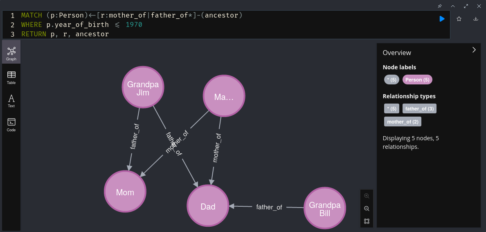
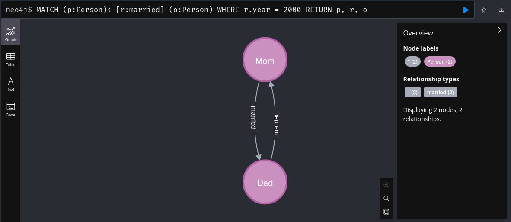

= Exercise 03
Florian Weingartshofer
:source-highlighter: rouge
:author: Florian Weingartshofer
:rouge-style: github

== Step 01

[source,postgresql]
----
include::script.sql[]
----

== Step 02

.Create Nodes
[source,cql]
----
CREATE (a:Person {name: 'Alex', father: 20, mother: 30})
CREATE (b:Person {name: 'Dad', father: 10, mother: null})
CREATE (c:Person {name: 'Mom', father: null, mother: null})
CREATE (d:Person {name: 'Grandpa Bill', father: null, mother: null})
CREATE (e:Person {name: 'Sister Amy', father: 20, mother: 30})

CREATE (b)-[:father_of]->(a)
CREATE (c)-[:mother_of]->(a)
CREATE (d)-[:father_of]->(b)
CREATE (c)-[:mother_of]->(e)
CREATE (b)-[:father_of]->(e)
----

.Get all Nodes and Vertices
[source,cql]
----
MATCH (n)
OPTIONAL MATCH (n)-[r]->(m)
RETURN n, collect(r), collect(m)
----

.All Person Nodes
[source,cql]
----
MATCH (p:Person)
RETURN p;
----

.All Person Nodes with name
[source,cql]
----
MATCH (p:Person)
RETURN p.name;
----

image::img/image-2023-05-28-07-49-04-574.png[]

.Create new Node
[source,cql]
----
CREATE (p:Person {name: "Grandma Mary"})
RETURN p;
----

.Create new Vertices
[source,cql]
----
MATCH (g:Person {name: "Grandma Mary"})
MATCH (m:Person {name: "Mom"})
MATCH (d:Person {name: "Dad"})
CREATE (g)-[:mother_of]->(m)
CREATE (g)-[:mother_of]->(d)
----

.Ancestors of Alex
[source,cql]
----
MATCH (a:Person {name: "Alex"})<-[:mother_of|father_of*]-(ancestor)
RETURN ancestor;
----

.Names of Ancestors of Alex
[source,cql]
----
MATCH (a:Person {name: "Alex"})<-[:mother_of|father_of*]-(ancestor)
RETURN ancestor.name;
----

image::img/image-2023-05-28-07-23-52-594.png[]

There is already a Grandpa Bill, I will just assume that Dad has two fathers.

.Create Grandpa Jim and his relations
[source,cql]
----
CREATE (j:Person {name: "Grandpa Jim"});
MATCH (m:Person {name: "Mom"})
MATCH (d:Person {name: "Dad"})
MATCH (j:Person {name: "Grandpa Jim"})
CREATE (j)-[:father_of]->(m), (j)-[:father_of]->(d);
----

.Ancestors of Grandpa Jim
[source,cql]
----
MATCH (a:Person {name: "Grandpa Jim"})<-[:mother_of|father_of*]-(ancestor)
RETURN ancestor;
----

.Marry Mom and Dad, Marry Grandma Marry and Grandpa Jim
[source,cql]
----
MATCH (mom:Person {name: "Mom"})
MATCH (dad:Person {name: "Dad"})
MATCH (gma:Person {name: "Grandma Mary"})
MATCH (gpj:Person {name: "Grandpa Jim"})

MERGE (mom)-[:married]->(dad)-[:married]->(mom)
MERGE (gma)-[:married]->(gpj)-[:married]->(gma)
----

.Show Ancestor Tree without Marriage
----
MATCH (a:Person)<-[r:mother_of|father_of*]-(ancestor)
RETURN a, r, ancestor;
----

=== Add properties to nodes and edges

.Add a property to all edges, that tell who is married to whom. It should store the year, when people got married.
[source,cql]
----
MATCH (tail:Person{name: "Dad"})-[r:married]-(head:Person{name: "Mom"})
SET r.year = 2000;

MATCH (tail:Person{name: "Grandma Mary"})-[r:married]-(head:Person{name: "Grandpa Jim"})
SET r.year = 1970;
----

.Add Birthyear
[source,cql]
----
MATCH (p:Person {name: 'Grandpa Jim'})
SET p.year_of_birth = 1940;

MATCH (p:Person {name: 'Grandma Mary'})
SET p.year_of_birth = 1935;

MATCH (p:Person {name: 'Mom'})
SET p.year_of_birth = 1970;

MATCH (p:Person {name: 'Dad'})
SET p.year_of_birth = 1965;

MATCH (p:Person {name: 'Alex'})
SET p.year_of_birth = 2000;

MATCH (p:Person {name: 'Sister Amy'})
SET p.year_of_birth = 2010;
----

.Query Ancestor Tree in a specific year
[source,cql]
----
MATCH (p:Person)<-[r:mother_of|father_of*]-(ancestor)
WHERE p.year_of_birth <= 1970
RETURN p, r, ancestor
----

.Find persons that have been married in a particular year.
[source,cql]
----
MATCH (p:Person)<-[r:married]-(o:Person)
WHERE r.year = 2000
RETURN p, r, o
----

== Step 03
.Add the Nodes and Edges of the complex example in the scriptum to Neo4J.
[source,cql]
----
CREATE
(n_america:Location {alias: 'NAmerica', name: 'North America', type: 'continent'}),
(europe:Location {alias: 'Europe', name: 'Europe', type: 'continent'}),
(usa:Location {alias: 'USA', name: 'United States', type: 'country'}),
(uk:Location {alias: 'UK', name: 'United Kingdom', type: 'country'}),
(england:Location {alias: 'England', name: 'England', type: 'country'}),
(austria:Location {alias: 'Austria', name: 'Österreich', type: 'country'}),
(idaho:Location {alias: 'Idaho', name: 'Idaho', type: 'state'}),
(london:Location {alias: 'London', name: 'London', type: 'city'}),
(upper_austria:Location {alias: 'UpperAustria', name: 'Oberösterreich', type: 'Bundesland'}),
(waldviertel:Location {alias: 'Waldviertel', name: 'Waldviertel', type: 'Viertel'}),
(grein:Location {alias: 'Grein', name: 'Grein', type: 'city'}),
(andrea:Person {alias: 'Andrea', name: 'Andrea'}),
(bert:Person {alias: 'Bert', name: 'Bert'}),
(christian:Person {alias: 'Christian', name: 'Christian'}),

(usa)-[:within]->(n_america),
(uk)-[:within]->(europe),
(england)-[:within]->(uk),
(austria)-[:within]->(europe),
(idaho)-[:within]->(usa),
(london)-[:within]->(england),
(upper_austria)-[:within]->(austria),
(waldviertel)-[:within]->(upper_austria),
(grein)-[:within]->(waldviertel),
(andrea)-[:born_in]->(idaho),
(andrea)-[:lives_in]->(london),
(bert)-[:born_in]->(grein),
(bert)-[:lives_in]->(london),
(christian)-[:born_in]->(london),
(andrea)-[:married]->(bert),
(bert)-[:married]->(andrea)
----

.Rewrite the MATCH statement in a way that makes it clear that only nodes with a label :Person are relevant and use a different variable to return the result.
[source,cql]
----
MATCH
(person:Person)-[:born_in]->()-[:within*0..]->(us:Location {name:'United States'}),
(person:Person)-[:lives_in]->()-[:within*0..]->(eu:Location {name:'Europe'})
RETURN person
----

== Step 04
The relationships of game of thrones are created in a complex graph:

.Create your own complex Graph
[source,cql]
----
CREATE
(jon:Character {name: 'Jon Snow', house: 'Stark'}),
(daenerys:Character {name: 'Daenerys Targaryen', house: 'Targaryen'}),
(viserys:Character {name: 'Viserys Targaryen', house: 'Targaryen'}),
(tyrion:Character {name: 'Tyrion Lannister', house: 'Lannister'}),
(cersei:Character {name: 'Cersei Lannister', house: 'Lannister'}),
(arya:Character {name: 'Arya Stark', house: 'Stark'}),
(sansa:Character {name: 'Sansa Stark', house: 'Stark'}),
(bran:Character {name: 'Bran Stark', house: 'Stark'}),
(nightKing:Character {name: 'Night King', house: 'White Walkers'}),

(jon)-[:SIBLING_OF]->(arya),
(jon)-[:SIBLING_OF]->(sansa),
(jon)-[:SIBLING_OF]->(bran),
(daenerys)-[:SIBLING_OF]->(viserys),
(tyrion)-[:SIBLING_OF]->(cersei),

(jon)-[:ALLIED_WITH]->(daenerys),
(tyrion)-[:ALLIED_WITH]->(daenerys),
(cersei)-[:ENEMY_OF]->(daenerys),

(nightKing)-[:ENEMY_OF]->(jon),
(nightKing)-[:ENEMY_OF]->(daenerys)
----

